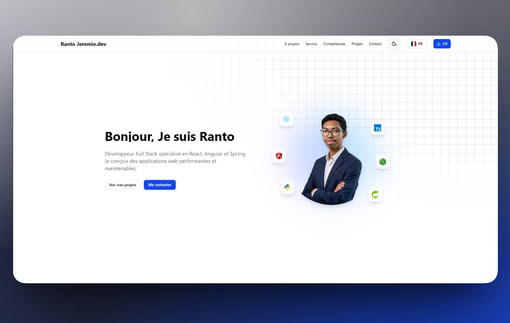

# Ranto Jeremie — Developer Portfolio

Personal portfolio of **Ranto Ravoninahitra (Jeremie)**, a Full Stack Developer based in Antananarivo, Madagascar. A modern, bilingual, animated single-page application showcasing services, skills, and projects.

<p align="center">
  
</p>

<p align="center">
  <a href="https://portfolio-jeremie04s-projects.vercel.app"><strong>🌐 Live demo</strong></a>
</p>

<p align="center">
  
  
  
  
  
</p>

---

## ✨ Features

- **Bilingual (FR / EN)** — automatic language detection with `i18next`, switchable at runtime.
- **Light & dark theme** — system-aware, toggled via `next-themes`.
- **Animated hero** — floating tech logos, animated gradient glow, and mouse parallax powered by GSAP.
- **Interactive skills** — categorized tech stack with proficiency progress bars.
- **Project showcase** — detail dialogs with an image carousel and per-project links.
- **Working contact form** — sends messages through EmailJS, plus direct email and WhatsApp links.
- **Fully responsive** — mobile-first layout across every section.
- **SEO ready** — meta tags, Open Graph, and JSON-LD structured data.
- **Performance-minded** — route-level code splitting, React Compiler, and Vercel Speed Insights.

## 🛠️ Tech Stack

| Area       | Technologies                                         |
| ---------- | ---------------------------------------------------- |
| Framework  | React 19, TypeScript, Vite 7                         |
| Styling    | Tailwind CSS 4, shadcn/ui (Radix UI)                 |
| Animation  | GSAP, `@gsap/react`                                  |
| i18n       | i18next, react-i18next                               |
| Theming    | next-themes                                          |
| UI extras  | Embla Carousel, Lucide, React Icons, Sonner (toasts) |
| Email      | EmailJS                                              |
| Deployment | Vercel                                               |

## 🚀 Getting Started

### Prerequisites

- [Node.js](https://nodejs.org/) 18+ and npm

### Installation

```bash
# Clone the repository
git clone https://github.com/Jeremie04/My-portfolio.git
cd My-portfolio

# Install dependencies
npm install

# Start the development server
npm run dev
```

The app runs on [http://localhost:5173](http://localhost:5173) by default.

## 📜 Available Scripts

| Command           | Description                                  |
| ----------------- | -------------------------------------------- |
| `npm run dev`     | Start the Vite development server (with HMR) |
| `npm run build`   | Type-check and build for production          |
| `npm run preview` | Preview the production build locally         |
| `npm run lint`    | Run ESLint                                   |

## 📁 Project Structure

```
src/
├── components/      # UI sections (Hero, About, Services, TechStack, Projects, Contact…)
│   └── ui/          # Reusable shadcn/ui-based primitives
├── config/          # i18next configuration
├── context/         # Theme provider
├── data/            # Content: skills, services, projects, parcours, soft skills
├── hooks/           # Custom hooks (e.g. useLanguage)
├── services/        # EmailJS integration
├── lib/             # Utilities
└── locales/         # Translation files (fr / en)
```

## 🌍 Internationalization

All user-facing content lives in `src/locales/{fr,en}/translation.json` (static text) and in the
`src/data/*` files (services, projects, parcours, soft skills), which expose `fr` and `en` variants.
The current language is read reactively through the `useLanguage` hook so every section updates
instantly when the language is switched.

## ☁️ Deployment

The site is continuously deployed on **Vercel** from the `main` branch. Every push triggers a new
production build. SPA routing and caching/security headers are configured in `vercel.json`.

## 📬 Contact

- **Portfolio** — [portfolio-jeremie04s-projects.vercel.app](https://portfolio-jeremie04s-projects.vercel.app)
- **GitHub** — [@Jeremie04](https://github.com/Jeremie04)
- **LinkedIn** — [Jeremie Ravoninahitra](https://www.linkedin.com/in/jeremie-ravoninahitra-4787362b2/)

---

<p align="center">Built with React, TypeScript &amp; Tailwind CSS.</p>
